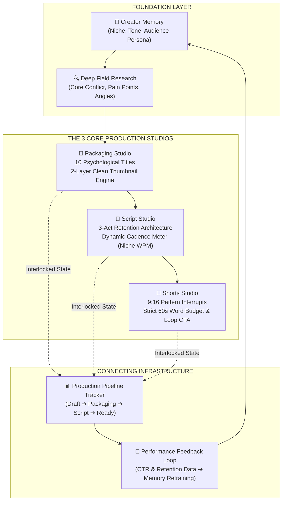

# Wavelength: Pre-Production Operating System for Serious Creators

**Wavelength** ek standalone "AI content generator" nahi hai. Ye YouTube creators ke liye ek specialized **Pre-Production Operating System (OS)** hai — jo ek raw thought ko camera record button dabane se pehle ek mathematically engineered, high-retention video blueprint me convert karta hai.

---

## 1. Positioning: OS vs Generic AI Tools

YouTube par 90% creators isliye fail hote hain kyunki unka pre-production process broken hota hai:
1. **Packaging Failure:** Video shoot hone ke baad title/thumbnail sochte hain, jisse CTR 2-3% par drop ho jata hai.
2. **Retention Collapse:** Random monologue record karte hain jisse pehle 30 seconds me 60% audience chhod kar chali jati hai.

Industry me maujood tools isolated pieces par kaam karte hain:
* **VidIQ / TubeBuddy:** Sirf reactive SEO tags aur search keyword counters dete hain.
* **Opus Clip / Munch:** Post-production video banne ke baad clips kaat-te hain (agar core video hi kharab hai to clips bhi fail hongi).
* **ChatGPT / Jasper:** Generic surface-level text dump karte hain jisme na spoken voiceover cadence hoti hai, na YouTube retention engineering.

```
+-----------------------------------------------------------------------------+
|                          WAVELENGTH PRE-PRODUCTION OS                       |
|                                                                             |
|   [ Foundation Layer ]       --> Research & Persistent Creator Memory       |
|            |                                                                |
|   [ 3 Core Studios ]         --> Packaging Studio (Titles & 2-Layer Art)    |
|                              --> Script Studio (3-Act Dynamic Cadence)      |
|                              --> Shorts Studio (9:16 Loop Multiplier)       |
|            |                                                                |
|   [ Connecting Infrastructure]--> Production Pipeline Tracker                |
|            |                     & Post-Publish Feedback Loop               |
+-----------------------------------------------------------------------------+
```

**Wavelength ka Core Philosophy:**
> **"Package First. Script Second. Record Last."**  
> Record ka button dabane se pehle clickability aur watch-time ko lock karna.

---

## 2. System Architecture: 3 Core Studios + 2 Supporting Layers

Wavelength ka workflow kisi linear step-by-step checklist jaisa nahi hai, balki ek cohesive operating system hierarchy hai jisme 3 specialized studios aur 2 persistent data layers aapas me interlocked hain:



---

### LAYER 1: FOUNDATION — Research & Creator Memory

Ye layer poore system ka cognitive baseline set karti hai taaki AI kabhi generic outputs na de.

#### A. Persistent Creator Profile (Channel Memory)
* **Purpose:** Har creator ka content style alag hota hai. Memory layer creator ke DNA ko capture karke rakhti hai:
  * **Selected Niche:** (e.g. *Tech & Coding*, *Personal Finance*, *Storytelling Documentary*, *Vlog / Gaming*).
  * **Target Audience Persona:** (e.g. *Tier-2 college engineering students*, *First-time retail investors*).
  * **Voice & Tone:** (e.g. *Pragmatic, sharp, zero-fluff* ya *High-energy, curious, dramatic*).
* **System Injection:** Ye profile data har studio call me background context ke roop me automatically inject hota hai.

#### B. Deep Field Research (Misconceptions & Psychological Angles)
* **Purpose:** Internet par har topic par hazaron videos maujood hain. Viewer tabhi click karega jab use koi hidden tension ya contrarian perspective dikhega.
* **Outputs:**
  * **Core Conflict:** Subject ke andar ka fundamental contradiction (e.g. *"BCA syllabus 10 saal purana hai, jabki tech industry har 6 mahine me AI stack badal rahi hai"*).
  * **Top 3 Viewer Pain Points:** Audience ke genuine internal fears aur friction points.
  * **3 Distinct Video Angles:** 
    * *Contrarian Angle:* Established belief ko challenge karna.
    * *Proof/Roadmap Angle:* Tangible execution blueprint dena.
    * *Exposé/Curiosity Angle:* Systemic reality ya industry secrets expose karna.
* **Data Source Grounding (Honesty & Roadmap):**
  * **Current Engine (Phase 1):** Cognitive LLM heuristics aur audience psychology models par based reasoning, jo structured synthesis ke zariye angles formulate karta hai.
  * **Real-Time Data Integration (Phase 2 Roadmap):** Live data pipelines — YouTube comment sentiment scraping (real audience questions identify karne ke liye), Reddit community discussion mining (e.g. r/cscareerquestions se genuine frustration points), competitor outlier video performance benchmarking, aur real-time web search integration.

---

### LAYER 2: THE 3 CORE PRODUCTION STUDIOS

#### 1. Packaging Studio (Thumbnail & Title Engineering)
Top creators ka niyam hai: **"Packaging decide karti hai ki script likhne ki mehnat justify hogi ya nahi."** Agar packaging weak hai, to script chahe Oscar-level ho, video flop hogi.

* **10 Psychological Title Frameworks:**
  * AI random titles generate nahi karta; proven click-psychology patterns use karta hai:
    * *Curiosity Gap* ("The Hidden Trap in Modern Frontend Frameworks")
    * *The Contrarian* ("Why Learning React in 2026 is a Waste of Time")
    * *The Exact Number* ("I Applied to 428 Remote Jobs — Only 3 Hired")
    * *Urgency & Warning* ("Stop Using Docker Until You Understand This")
* **2-Layer Clean Thumbnail Engine (Technical Reality):**
  > **Crucial Rule:** AI image diffusion models se text generate karwane par text distort aur unreadable ho jata hai. Wavelength is issue ko **2-Layer Architecture** se solve karta hai:
  * **Layer 1 (AI Canvas - Clean Background):** Model prompt ko sanitize karke sirf visual atmosphere, dynamic lighting, facial subject, aur negative space (rule-of-thirds) generate karta hai — **strictly zero embedded text**.
  * **Layer 2 (Vector Typography Overlay):** Text ko application-level vector graphic layer (HTML5 Canvas / CSS engine) me alag se overlay kiya jata hai:
    * **Display Fonts:** Google Fonts standard (*Anton*, *Bebas Neue*, *Montserrat ExtraBold*).
    * **Styling:** High-contrast color fills (Pure Yellow `#FACC15`, Electric White `#FFFFFF`), heavy drop-shadows, sharp strokes, aur 1–3 punchy words (e.g., `"DO NOT DO THIS"` ya `"ZERO TO $10K"`).
* **Live CTR Preview Environment:**
  * Creator ko 3 simulated views milte hain: Desktop Home Grid, Mobile Feed View, aur Dark Mode context — upload karne se pehle visual hierarchy verify karne ke liye.

---

#### 2. Script Studio (Retention-Engineered Long-Form Architecture)
Robotic video scripts audience ko 45 seconds ke andar drop karwa deti hain. Script Studio natural spoken rhythm aur visual cues ke sath script construct karta hai.

* **Dynamic Spoken Cadence Engine (Niche-Based WPM):**
  Static 145 WPM har category par suit nahi karta. Creator Profile ke niche ke mutabiq Wavelength spoken duration aur word-budget dynamically calculate karta hai:
  * **Tech, Coding & Tutorials:** `120 – 135 WPM` (Deliberate pacing; viewers code aur terminal output digest karne ke liye thoda pause chahte hain).
  * **Storytelling, Video Essays & Documentaries:** `135 – 150 WPM` (Rhythmic pacing; tension build-up aur narrative depth ke liye zaroori).
  * **Vlogs, Gaming, Commentary & Entertainment:** `150 – 165 WPM` (High-energy, fast dopamine flow, quick cuts).
* **3-Act Structural Blueprint:**
  * **Act 1: The Verbal Hook & Stakes (00:00 – 01:30):** First 15 seconds me title/thumbnail ka promise validate karna bina "Hi guys, welcome back" bole.
  * **Act 2: Tension Loops & Escalation (01:30 – 07:00):** Multiple open curiosity loops create karna taaki viewer video mid-point par na chhod de.
  * **Act 3: The Climax, Payoff & Natural Next-Watch CTA (07:00 – End):** Clear solution deliver karna aur agle video par bridge karna.
* **Integrated Director Cues:**
  * Script text me audio-visual markers embedded hote hain:
    * `[VISUAL: Side-by-side terminal comparison]`
    * `[B-ROLL: Bouncing cursor on rejection email]`
    * `[SFX: Subtle low-pass bass drop]`

---

#### 3. Shorts Studio (9:16 Vertical Content Multiplier)
Har high-effort long-form video se high-leverage short-form assets nikalna ek modern OS ki responsibility hai.

* **0–3s Verbal Pattern Interrupt:** First frame me scroll rokne wala shock factor ya counter-intuitive sentence.
* **Strict 60-Second Word Budget:** 
  * 130–150 words total budget enforcement taaki audio delivery fast aur engaging rahe.
* **Seamless Loop CTA:** 
  * Short ka aakhri sentence pehle sentence ka logical prefix banta hai (e.g., End line: *"And that is the exact reason why..."* -> Start line: *"You are failing your technical interviews"*), jisse watch-time 110%+ exceed hota hai.

---

### LAYER 3: CONNECTING INFRASTRUCTURE

#### A. Production Pipeline Tracker (Command Center)
Creators ko multiple spreadsheets ya Trello boards maintain karne ki zaroorat nahi hai. Wavelength har video project ke lifecycle ko track karta hai:
* **Stage 1:** `Research & Angles Formulated`
* **Stage 2:** `Packaging Locked (Title + 2-Layer Thumbnail Ready)`
* **Stage 3:** `Script Blueprint Drafted & Cadence Verified`
* **Stage 4:** `9:16 Shorts Extracted`
* **Stage 5:** `Ready to Record (Teleprompter Ready)`
* **Stage 6:** `Published & Tracking`

#### B. Performance Feedback Loop (Post-Publish Intelligence)
Wavelength sirf ek one-time prompt generator nahi hai jo script dekar bhool jaye. Ye ek **True Operating System** hai jo publishing ke baad ke feedback data se lagataar evolve hota hai:

```
[ Published Video Metrics ] 
           │
           ├──> CTR % (Click-Through Rate)
           ├──> 30s Retention Rate %
           └──> Average Percentage Viewed (APV)
           │
           ▼
[ Performance Feedback Ingestion ]
           │
           ├── CTR < 4%  ➔ Flag Packaging: Title curiosity gap was weak; re-tune thumbnail contrast rules.
           ├── CTR > 10% ➔ Win Pattern: Store winning Title Formula in Creator Memory as High-Weight.
           ├── Drop at 30s ➔ Flag Hook Mismatch: Hook did not match thumbnail promise; tighten Act 1.
           └── High Retention ➔ Win Pattern: Store cadence and tension structure as primary preset.
           │
           ▼
[ Adaptive Creator Memory Update ]
(Future Blueprints Automatically Inherit Proven Channel Wins)
```

1. **Packaging Refinement:** Agar *The Contrarian* formula aapke channel par standard 9.8% CTR la raha hai jabki *How-To* 4.2% par ruk raha hai, to system future recommendations me Contrarian framework ko prioritize karega.
2. **Hook-to-Packaging Integrity Check:** Agar 0–30s retention me sharp decline hota hai, to Feedback Engine diagnose karega ki script hook ne thumbnail ke visual promise ko immediately address nahi kiya tha.
3. **Pacing Calibration:** Agar tutorial videos me retention 4th minute par drop ho rahi hai, to system creator ki cadence baseline ko 135 WPM se 125 WPM calibrate karne ka recommendation dega.

---

## 3. The Creator UX: What It Feels Like

| Metric | Traditional Workflow | Wavelength Pre-Production OS |
| :--- | :--- | :--- |
| **Tooling** | 5 alag tools (Notion + ChatGPT + Canva + VidIQ + Opus) | **Single Unified Pre-Production OS** |
| **Packaging Sequence** | Video shoot hone ke baad hasty title/thumbnail | **Packaging-First:** Title & Thumbnail lock hone ke baad hi scripting allow hoti hai |
| **Thumbnail Quality** | Blurry AI text ya Canva drag-drop chaos | **2-Layer Architecture:** Pure AI canvas + Sharp Anton vector overlay |
| **Script Cadence** | Random unmeasured word count monologue | **Dynamic WPM Meter** matched to creator niche |
| **Evolution** | Har video par zero se shuruat | **Closed Feedback Loop:** Post-publish metrics train future blueprints |

Wavelength is built to give the creator the feeling of sitting in an **executive YouTube war-room** — fast, mathematically validated, and focused entirely on content that wins the algorithm before the camera ever turns on.
